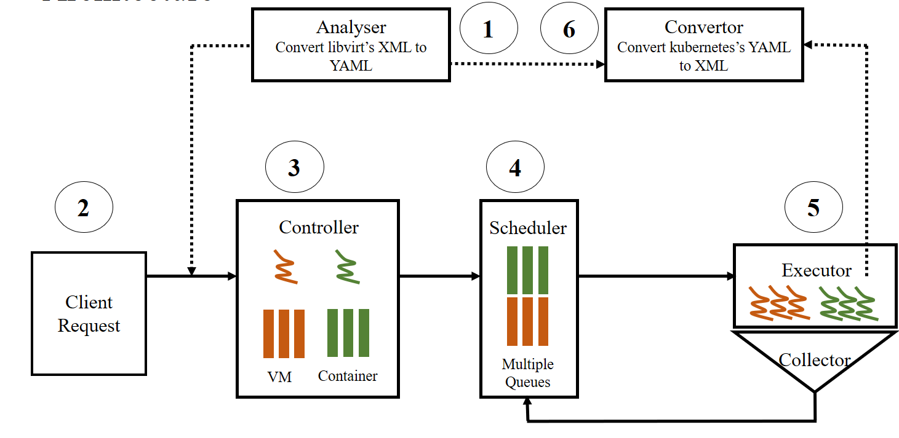

# KubeVirt

**KubeVirt** is a virtual machine management add-on for Kubernetes.
The aim is to provide a common ground for virtualization solutions on top of
Kubernetes.

**Note:** KubeVirt is a heavy work in progress.

**Thanks**
- wuheng@otcaix.iscas.ac.cn
- wuyuewen@otcaix.iscas.ac.cn
- xuyuanjia2017@otcaix.iscas.ac.cn
- xianghao16@otcaix.iscas.ac.cn
- shizhonghao17@otcaix.iscas.ac.cn
- yangchen18@otcaix.iscas.ac.cn

# Introduction

## Virtualization extension for Kubernetes

At its core, KubeVirt extends [Kubernetes][k8s] by adding
additional virtualization resource types (especially the `VM` type) through
[Kubernetes's Custom Resource Definitions API][crd].
By using this mechanism, the Kubernetes API can be used to manage these `VM`
resources alongside all other resources Kubernetes provides.

Unlike [kubevirt/kubebirt](https://github.com/kubevirt/kubevirt), we do not
plan to manage VM using the pod model. Instead, we design a new virtctl to
support VM's lifecycle.

## Limitations

- just focus on compute resource (libvirt), it cannot replace Openstack (network, storage, and so on)
- we do not want to support VM migration
- the size of VirtualMachine yaml shou not be great than 128K

## Capacities

- VirtualMachine
- VirtualNetwork
- VirtualDisk
- Snapshot

see [xml style](convertor/docs/libvirt-xml.md), or [json style](convertor/docs/libvirt-json.md), or [yaml style](convertor/docs/libvirt-yaml.md)

# Architecture

- **[Analyser](analyser)**: converte libvirt's XML to Kubernetes's YAML, the libvirt's XML is used by [Openstack](https://www.openstack.org/). 
- **[Controller](controller)**: extend Kubernetes to support VirtualMachine resource
- **Scheduler**:  extend Kubernetes to schedule VirtualMachine
- **Executor**:  manage VM's lifecycle.
- **[Convertor](convertor)**: converte Kubernetes's YAML to libvirt's XML.

# Roadmap

- **2019.5**: support VM's lifecycle
- **2019.6**: support snapshot's lefecycle
- **2019.7**: support cni, so we can reuse kubernetes's network
